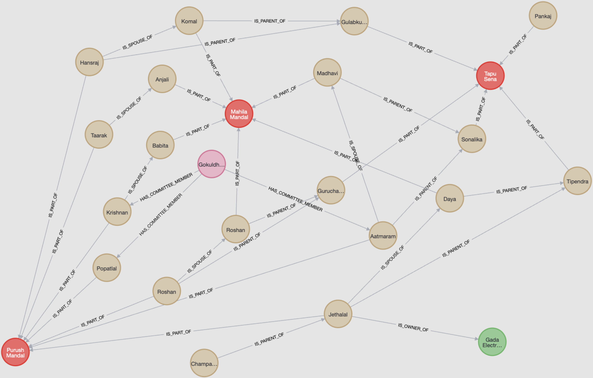

# QnA on Knowledge Graph
Demonstration of a question answering system based on RAG with a knowledge graph in Neo4j (graph database) as the source of information. Neo4j's ability to store vector embeddings removes the need for a separate vector database.

Flow:  
Given a user query,  
1. Find relevant nodes, relationships in the knowledge graph
2. Generate cypher query to retrieve the data from the knowledge graph
3. Execute cypher query
4. Generate final answer

# Knowledge Graph


# Demo
### LLama 3.3 70B with RAG 
```
Q: who is the husband of babita ?
A: The husband of Babita is Krishnan Iyer.
```

```
Q: Which group is Jethalal's son a part of ?
A: Jethalal's son is a part of the "Tapu Sena" group.
```

```
Q: what is the nick name of the only female member of tapu sena ?
A: The nickname of the only female member of Tapu Sena is Sonu.
```

```
Q: who is the secretary ?
A: The secretary is Aatmaram Bhide.
```

```
Q: Anjali chya navryacha nav kay?
A: Anjali chya navryacha nav Taarak Mehta ahe.
```

```
Q: Who is the treasurer ?
A: The treasurer is Krishnan Iyer.
```

```
Q: What is the nickname of Bhidu's wife ?
A: The nickname of Bhidu's wife is Madhu.
```

### LLama 3.3 70B without RAG (Incorrect Answers) 
```
Q:
In TMKOC
Who is the treasurer ?

A: In the popular Indian sitcom Taarak Mehta Ka Ooltah Chashmah (TMKOC), the treasurer of the Gokuldham Society is Aatmaram Tukaram Bhide, also known as Bhidé.
```
```
Q: 
In TMKOC
What is the nickname of Bhidu's wife ?

A:
In the popular Indian sitcom Taarak Mehta Ka Ooltah Chashmah (TMKOC), Bhidé's wife is often referred to as "Babita".
```

`llama 3.3 70B` answers the above two questions incorrectly by itself.
Apart from the above two questions, `llama 3.3 70B` is able to answer the rest of the questions without the need for RAG. This must be due to the training data of the model on the publicly available data.

# Env Setup

## Python Environment
Create a virtual environment and install the required packages.

```bash
pip install -r requirements.txt
```
Note: The top-level requirements are mentioned in `requirements.in`. The `requirements.txt` file is generated using `pip-tools`.

## Neo4j
To use Neo4j, one of the following options can be used:
* Use docker for neo4j via docker compose (used in this project)
* Install Neo4j locally
* Use Aura DB (cloud-based Neo4j)
* Use any other cloud-based Neo4j service

### Docker
Run the following command to start the Neo4j server using docker-compose.
```bash
docker compose up -d
```

The Neo4j server can be accessed at port 7687 programmatically and at port 7474 for the browser.
As per the docker-compose file, the username and password are `neo4j` and `neotest123` respectively.

# Usage
1. Create a knowledge graph in Neo4j  
Run `python create_kg.py` to create a knowledge graph in Neo4j.

2. Setup embeddings, vector indexes, and unique_id indexes  
Run `python setup_embeddings_and_indexes.py` to
    * Generate embeddings for nodes and relationships properties data
    * Update the nodes, relationships with embeddings
    * Create vector indexes
    * Create index on unique_id property of nodes and relationships

3. LLM Setup  
Either use ollama locally or use github models. The llm configuration is present in `llm.py`.   
    To use github models,
    * Update `llm_index_to_use` in `llm.py` 
    * Duplicate the `sample_env.ini` file and rename it to `env.ini`
    * Add the github token in the `env.ini` file

4. QnA System  
Run `python app.py` to run the application.


# Modules Details
`create_kg.py`
Create a knowledge graph in Neo4j.

`setup_embeddings_and_indexes.py`
Generate embeddings for nodes and relationships properties data, update the nodes, relationships with embeddings, create vector indexes, create index on unique_id property of nodes and relationships.

`models.py`
Using neomodel which is an Object Graph Mapper (OGM) for Neo4j, define the schema of the database among other things.

`prompts.py`
Contains the prompt templates for generating cypher query and generating final answer.

`get_relevant_data.py`
Given a user query, find the related nodes, relationships in Neo4j graph database.

`generate_cypher.py` 
Given user query, schema of the database and relevant data, generate cypher query to fetch the data from Neo4j.

`execute_cypher.py`
Execute the generated cypher query. If the output contains any nodes, relationships, then return the properties (except the embedding) and labels/relationship type. Any other output is returned as it is.

`generate_answer.py`
Given the user query, schema of the database, relevant data, cypher query, and the output of the cypher query, generate the answer to the user query.

`llm.py`
Contains the configuration for LLM model to use.

`llms directory`
Dir to hold various llm models classes, making the code extensible.

`utils.py`
Contains various utility functions, notably `get_schema_text`, `execute_cypher_query` and `extract_cleaned_cypher`.

`vector_utils.py`
Contains functions to generate embeddings and search for similar vectors

`consts.py`
Contains the constants used in the project such as the list of stopwords.

`questions.txt`
List of sample questions to test the system.


